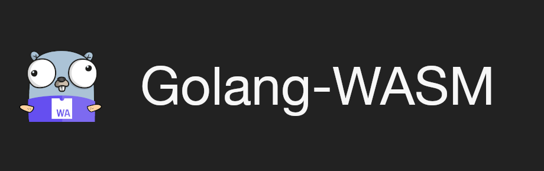

<p align="center">
    <a href="https://github.com/teamortix/golang-wasm">
        
    </a>
</p>
<p align="center">A bridge and bindings for JS DOM API with Go WebAssembly.</p>
<p align="center">Written by Team Ortix - <a href="https://github.com/hhhapz">Hamza Ali</a> and <a href="https://github.com/chanbakjsd/">Chan Wen Xu</a>.</p>
<p align="center">
    <a href="https://pkg.go.dev/github.com/teamortix/golang-wasm/wasm">
        
    </a>
    <a href="https://goreportcard.com/report/github.com/teamortix/golang-wasm">
        
    </a>
    <br>
    <br>
</p>

```
GOOS=js GOARCH=wasm go get -u github.com/teamortix/golang-wasm/wasm
```
```bash
npm install golang-wasm
```

# ⚠️ The documentation is still work in progress.

## Why Golang-WASM?

Golang-WASM provides a simple idiomatic, and comprehensive (soon™️) API and bindings for working with WebAssembly.

Golang-WASM also comes with a [webpack](https://npmjs.com/golang-wasm) loader that wraps the entire API so that it is idiomatic for JavaScript developers as well as Go developers.

Here is a small snippet:
```go
// main.go
// Automatically handled with Promise rejects when returning an error!
func divide(x int, y int) (int, error) {
    if y == 0 {
        return 0, errors.New("cannot divide by zero")
    }
    return x / y, nil
}

func main() {
    wasm.Expose("divide", divide)
    wasm.Ready()
}
```
```js
// index.js
import { divide } from "main.go";

const result = await divide(6, 2);
console.log(result); // 3

// Exception thrown: Unhandled rejection in promise: cannot divide by zero.
const error = await divide(6, 0);
```

When using the webpack loader, everything is bundled for you, and you can directly import the Go file.

> Note: the webpack loader expects you to have a valid Go installation on your system, and a valid GOROOT passed.

## JS Interop

### Examples

You can find our examples in the [examples](./example) directory.
Currently, we have two examples available.

* [basic](./example/basic): Simple usage of the API with the WASM library. This example shows automatically casting types from JS to Go, and how returning errors works.

* [basic (no api)](./example/basic-noapi): A standalone example of using the JS bridge without any third party libraries in Go. Forces developers to manually type check all parameters and use the unsafe `syscall/js` directly.

* (WIP) [promises](./example/promises): An example showing how Go can work with functions that call promises, and return its own promises. This example puts an emphasis on the importance of idiomatic code in both languages.

* (WIP) [craco + ReactJS](./example/craco): A simple example demonstrating how Golang-WASM and React can work together, using [craco]https://github.com/gsoft-inc/craco).

### Retrieving constants and values from JavaScript

For more information about how Golang-WASM converts Go data to JS, read [Auto type casting](#auto-type-casting).

```go
type User struct {
    Name     string `wasm:"name"`
    Email    string `wasm:"emailAddr"`
    Age      int    `wasm:"age"`
    password string // ignored (unexported)
}

const Nothing  = nil         // Exposed as 'nothing'.
const Username = "TeamOrtix" // exposed as username.
const Age      = 3

var hhhapz = User { // exposed as hhhapz.
    Name:     "Hamza Ali",
    Email:    "me (at) hamzantal dot pw",
    Age:      17,
    password: "wouldn't_you_like_to_know"
}
var goodPromise = wasm.NewPromise(func() (interface{}, error) {
    return "success", nil
})
var badPromise = wasm.NewPromise(func() (interface{}, error) {
    return nil, errors.New("failure")
})
```

```js
import wasm from ...;

await wasm.nothing();  // null
await wasm.username(); // "TeamOrtix"
await wasm.age();      // 3
await wasm.hhhapz();   /* {
    name: "Hamza Ali",
    emailAddr: "me (at) hamzantal dot pw",
    age: 17
} */
await wasm.goodPromise(); // Promise(fulfilled: "success")
await wasm.badPromise();  // Promise(rejected:  Error("failure"))
```

> Note: For the last two, The resulting value of calling `goodPromise` or `badPromise` will be a Promise wrapped inside a Promise.

> If Go returns multiple promises embedded within each other, the stack will automatically flatten like it does in JS.

---

### Working with functions

When a Go function returns a value, they are handled identically to constants and variables.

**⚠️ For functions that can also fail/return errors, please do not use panics!**

The [working with errors](#working-with-errors) section covers how errors can be sent to JavaScript.

**Brief Overview**:

```go
func ZeroParamFunc() {
} // await call() => undefined


func StringReturnFunc() string {
    return "Team Ortix"
} // await call() => "Team Ortix"


func StringOrErrorReturnFunc() (string, error) {
    return "Team Ortix", nil
} // await call() => "Team Ortix"


func FailOrNil() (error) {
    return nil
} // await call() => undefined


func FailingFunc() error {
    return errors.New("fail")
} // await call() => Error("fail")


func FailingFunc() (string, error) {
    return "", errors.New("fail")
} // await call() => fail


func SingleParam(str string) string  {
    return str
}
// await call() => Rejected Promise: Error("invalid argument passed into Go function")
// await call("Team Ortix", "fail") => Rejected Promise: Error("invalid argument passed into Go function")
// await call("Team Ortix") => "Team Ortix"


func TakeAnything(v interface{}) interface{}  {
    return v
}
// call(3) => 3
// call(() => {}) => (() => {})
// call({}) => {}


func HigherOrderFunction(f func() string) string {
    return f()
}
// await call(() => {}) // Go will panic and shut down. Higher order functions like this MUST return the same type.
// await call("invalid") => Rejected Promise: Error("invalid argument passed into Go function")
// await call(() => "test") => "test"


func HigherOrderFunctionSafe(f func() (string, error)) string {
    str, err := f()
    if err != nil {
        return "invalid return value!"
    }
    return str
}
// call(() => {}) => "invalid return value!"
// call(() => "Team Ortix") => "Team Ortix"


func FunctionThatThrows(f func()) {
    f()
}
// call(() => { throw new Error("fail")}) // Go will panic in this situation.


// Not implemented yet.
func DidFunctionSucceed(f func() error) bool {
    res := f()
    return res == nil
}
// call(() => {}) => true
// call(() => { throw new Error("fail") }) => false
```

### Auto type casting

* If a `nil` value is found, it is converted to JavaScript's `null`.

* For Go primitives, marshalling to JS works as one would expect.

    |          Go Type          |            JS Type           |
    |:-------------------------:|:----------------------------:|
    |           string          |            String            |
    |            uint           |            Number            |
    |            int            |            Number            |
    |           float           |            Number            |
    |          complex          | {real: Number, imag: Number} |
    |           Symbol          |         unimplemented        |
    |        map[string]T       |            Object            |
    |      [size]T (array)      |             Array            |
    |        []T (slice)        |             Array            |

* For Go structs, unexported values inside structs will NOT be marshalled.

    * If a struct has a tag (with the wasm namespace), that will be used as the key.

    * If two properties have the identical key, the value that is declared second in the struct deceleration will overwrite the former value.

* When converting a Go Map (`map[K]V`), all keys must be a `uint`, `int` or a `string`.

    * **⚠️ If a different kind of key is found, WASM will panic.**

* If a pointer is found, the pointer is unwrapped till the raw value is found.

* Slices and arrays are automatically converted to the JavaScript Array object.

* Marshalling function parameters to Go values has slightly different functionality.

    * If a function parameter is not a concrete type (`interface{}`), Go returns types in the following fashion:
-
        |  JS Type  |                  Go Type                  |
        |:---------:|:-----------------------------------------:|
        | undefined |                    nil                    |
        |    null   |                    nil                    |
        |  Boolean  |                    bool                   |
        |   Number  |                  float64                  |
        |   String  |                   string                  |
        |   Symbol  |               unimplemented               |
        |   Array   |        [size]interface{} (Go array)       |
        |   Object  |           map[string]interface{}          |
        |  Function | func(...interface{}) (interface{}, error) |


    * Go pointers will result in the basic value.

    * Structs will be filled.

        * All of the keys in the struct must be keys in the object.

        * If there are keys in the object but not in the struct, they will be skipped.

        * Currently, even if a struct value is a pointer to a type, the value will be nil.

            * You can use this functionality for optional values in structs.

    * Providing a `map[string]interface{}` will directly fill the map as expected with the keys of the object and the respective values.

    * If a function parameter is a concrete type, Golang-WASM will try to convert the JS Value to the Go type using the table above.

       * If the types do not match, The caller will receive a rejection promise and the function will never be called.

       * Apart from `float64`, `Number` will be safely casted to all `uint` types, `int` types, and `float32`.

       * Decoding into `complex64` and `complex128` is similar to when they are encoded. A JS Object with a `real` and `imag` property (type Number) are expected.


### Working with errors

* Functions can only return 0, 1, or 2 values.

    * If the function's last return value is of type error, and the error is non-nil, it will reject with the provided error message.

    * Functions that only return `error` will return `undefined` when `nil` as well.

    * If the second return value is not `error`, Go will not call the function and instead return an error with the following message:

        > a JS function can only return one value


### DOM API

Currently, little to none of the DOM-API has been implemented in Go.

The goal for Golang-WASM is to eventually implement a comprehensive section of the DOM-API that will be able to be used in a type safe manner from Go.

When converting the API over, Golang-WASM will make slight modifications to attempt to maintain idiomatic code when writing Go.

### Promise API

Here is how Go implements the Promise API:

```go
// Create a new promise and resolve or reject it, based on what the function returns.
func ExpensiveOperation() wasm.Promise {
    // Code is automatically called in a goroutine, similar to how JS does it.
    return wasm.NewPromise(func() (interface{}, error) {
        result, err := // Expensive operation.
        if err != nil {
            return nil, err // Reject the Promise.
        }
        return result, nil // Resolve the Promise.
    })
}

// Wait for a promise to be fulfilled or rejected.
// Note: this must be called inside a goroutine.
// If called within the main thread, Go will deadlock and shut down.
// out: the value that will be set when the promise is fulfilled.
// rej: the value that will be set when the promise is rejected.
// success: whether the promise was fulfilled (true) or rejected (false).
promise := AnotherOperation()
var out int
var rej  error
success, err := promise.Await(&out, &rej)
if err != nil {
    // Something went wrong with converting types or interacting with JS.
}


// Run multiple asynchronous operations at once and wait for them to all end.
promise = wasm.PromiseAllSettled(ExpensiveOperation(), AnotherOperation())

// If you want to make sure all are fulfilled and not rejected, you can use.
promise = wasm.PromiseAll(ExpensiveOperation(), AnotherOperation())

// Wait for any of the promises to fulfill. If none of them fulfill and all reject, this promise will also reject.
promise = wasm.PromiseAny(ExpensiveOperation(), AnotherOperation())

// Run all operations in asynchronous and return the first one to either fulfill or reject.
promise = wasm.PromiseRace(ExpensiveOperation(), AnotherOperation())
```

### How it works

Golang-WASM uses reflection to marshal to and from JS.
To understand the different modules of the project, we suggest reading [ARCHITECTURE.md](./ARCHITECTURE.md).

The implementation of things such as throwing errors from Go and catching thrown errors in JS from Go happen through the usage of wrapper functions.
Here is one of such functions that is wrapped when calling a JS function from Go:
```js
const callSafe = (f) => ((...args) => {
     try {
         return {result: f(...args)};
     } catch (e) {
      return {error: e};
    }
})
```

Go is able to marshal this into a struct:
```go
type SafeCallResult struct {
    Result js.Value `wasm:"result"`
    Error js.Value  `wasm:"error"`
}
```

---

## Webpack Configuration

See the example [basic](./example/basic/webpack.config.js) project for a full configuration.

```js
// webpack.config.js:
module.exports = {
    module: {
        rules: [
            {
                test: /\.go$/,
                use: [ 'golang-wasm' ]
            }
        ]
    },
    ignoreWarnings: [
        {
            module: /wasm_exec.js$/
        }
    ]
};
```

### Hotcode Reload

To ensure that hotcode reloading works, the Webpack loader expects a `go.mod` to be in the directory of the imported file, or a parent directory.

Go will call `go build [directory]` where the file is imported.

Given the following directory structure from this project's basic example:

```ls
basic
├── dist
│   └── index.html
├── go.mod
├── go.sum
├── package.json
├── package-lock.json
├── src
│   ├── api
│   │   └── main.go
│   └── index.js
└── webpack.config.js
```

* Golang-WASM webpack will look for a `go.mod` file in `api/`, then `src/`, and then `basic`, till the root directory.

    * When it finds a `go.mod`, the loader will start looking in the directory for changes to any file for hotcode reload.

    * If no `go.mod` is found, the loader will fail.

    * The loader runs build in the `api` directory:

        > ```
        > go build .../basic/src/api
        > ```


## FAQ

### Is it possible to use multiple instances of Web Assembly in the same project

At the moment, this is not supported.

### When will the DOM API be implemented?

The DOM API is expanse and large. We can't give a particular date or time. You are free to monitor our progress in this repository.


### When will the API be stable?

Once we have comprehensive tests and the confidence that the project can be used in production with reasonable stability, we will push v1.0.0 for the project.

We encourage everyone to submit any errors they may come across and help us with the development process :).

## License

**MIT**.

---
Created by [hhhapz](https://github.com/hhhapz) and [chanbakjsd](https://github.com/chanbakjsd).
